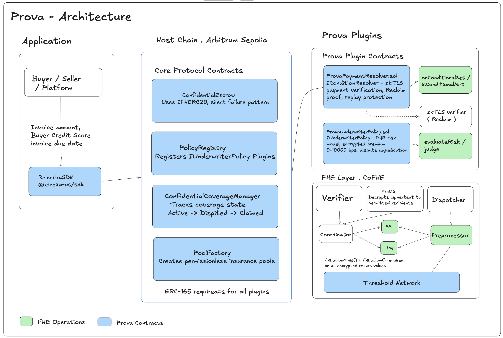

# Prova: Decentralized Trade Credit Insurance

Prova is a privacy-first, on-chain trade credit insurance protocol built explicitly for SME exporters in emerging markets. By leveraging Fully Homomorphic Encryption (FHE) via **Fhenix** and trustless settlement via **ReineiraOS**, Prova allows businesses to secure cross-border B2B invoices against non-payment without ever exposing their sensitive customer data or profit margins to the public ledger.

---

## 🏗️ System Architecture

Our dual-plugin architecture separates the privacy-preserving actuarial math from the host chain's execution layer:



### The Dual-Layer Tech Stack
1. **ReineiraOS (Settlement Engine):** Operates on Arbitrum Sepolia. Prova utilizes the `@reineira-os/sdk` to hook directly into the `ConfidentialCoverageManager` to pool insurance liquidity (USDC) and the `ConfidentialEscrow` contracts to enforce automated payouts.
2. **Fhenix Operations (Privacy Engine):**
   * **Frontend (`@cofhe/react`):** Exporters input their invoice amounts and confidential buyer credit scores in our React dashboard. The client-side hook encrypts this data entirely in the browser memory before it touches the blockchain.
   * **Backend (`@fhenixprotocol/cofhe-contracts`):** Our custom `ProvaUnderwriterPolicy` smart contract prices the risk premium dynamically using FHE math (`FHE.mul(invoiceAmount, riskMultiplier)`). This ensures the underlying datasets are mathematically processed securely on Fhenix’s coprocessor without ever returning plaintext.

---

## 🌍 Go-To-Market (GTM) Strategy

Our GTM strategy targets the **$28 Trillion global trade market**, focusing specifically on the structural gap left by legacy trade credit insurers who systematically reject businesses with under $1M in annual turnover. 

### 1. Target Corridors
We are launching specifically into high-velocity, emerging market export corridors where the demand for single-invoice credit protection ($5,000 to $50,000 range) is massively underserved. Initial pilot corridors include:
*   **Nigeria ➡️ United Kingdom** (Agriculture & Textiles)
*   **Kenya ➡️ India** (Commodities)

### 2. User Acquisition & Distribution
Traditional insurers require massive historical datasets to underwrite. By automating the underwriter and claims adjuster roles natively on-chain, our unit economics permit us to underwrite micro-policies profitably. We will partner directly with B2B cross-border payment platforms and fiat-on-ramps (leveraging Circle's CCTP) to embed Prova's FHE underwriting directly at the point of invoice generation.

### 3. Yield Mechanics
Our GTM relies on bootstrapping permissionless USDC insurance pools. Liquidity Providers supply stablecoins to back the coverage manager in exchange for the FHE-calculated risk premiums generated by the exporters, establishing a completely decentralized trade-finance loop.

---

## 💻 Developer Setup Guide

The underlying standard utilized for these packages complies strictly with the official ReineiraOS development toolkit and the Fhenix CoFHE hooks.

### Running the Environment

**1. Install Dependencies**
```bash
# Frontend UI (Client-Side Encryption)
cd frontend
npm install

# Backend Smart Contracts (FHE Mocks)
cd ../contracts
npm install
```

**2. Test the Actuarial FHE Math in Hardhat**
```bash
cd contracts
npx hardhat test
```
*This verifies the `ProvaUnderwriterPolicy.sol` mock algorithms run correctly via `hre.cofhe.initializeLocalFHE()`.*

**3. Run the Frontend Dashboard**
```bash
cd frontend
npm run dev
```
*Navigate to localhost to test the in-browser FHE ciphertext generation before submitting to Arbitrum Sepolia.*
# Prova
